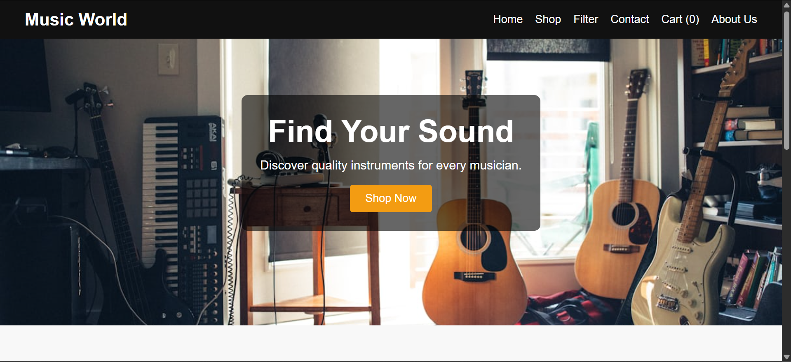
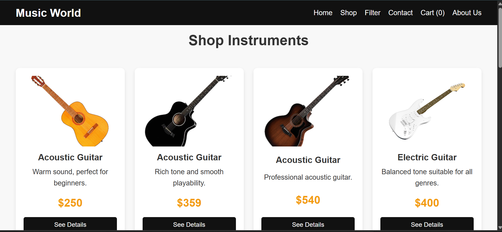
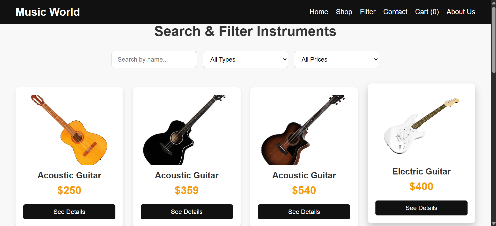
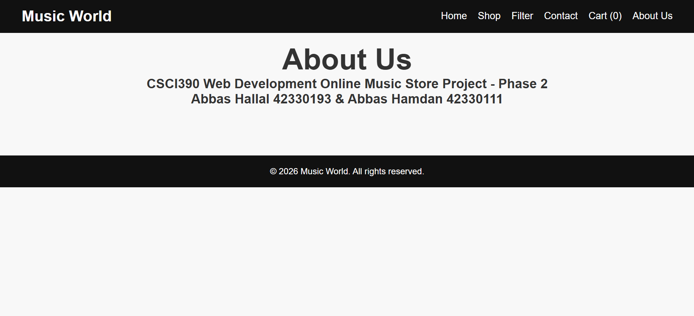
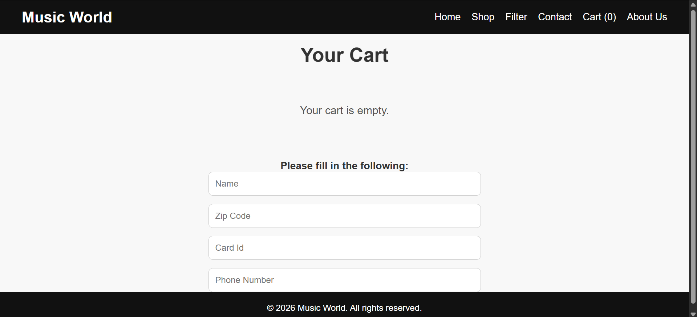

## Music World React Project

## Project Description

Music World is a React-based music store website. The website allows users to browse musical instruments, view product details, filter instruments, and navigate between different pages such as Home, Shop, Filter, Cart, About, and Contact.

The project was developed as Phase 2 of the web project using React.js and JavaScript. It improves the previous website by using React components, routing, reusable product cards, and organized styling files.

## Technologies Used

- React.js
- JavaScript
- HTML
- CSS
- React Router
- Git
- GitHub

## Main Features

- Home page
- Navigation bar
- Shop page with product cards
- Product detail pages
- Filter instruments by name, category, and price
- Cart page
- Contact page
- Responsive design

## Setup Instructions

To run this project on your computer:

1. Download or clone the repository.
2. Open the project folder in Visual Studio Code.
3. Open the terminal inside the project folder.
4. Install the required packages:

npm install

5. Start the React project:

npm start

6. Open the website in the browser:

http://localhost:3000

## Screenshots

## Home Page

## Shop Page

## Filter Page

## Contact Page

## About Page

## Cart Page

## Author

Prepared by: Abbas Hallal - 42330193
Prepared by: Abbas Hamdan - 42330111

## Course

CSCI390 - Spring 2025-2026